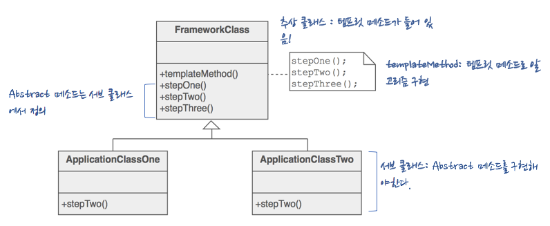

#  템플릿 메소드 패턴이란?

### 템플릿 메소드 패턴 정의

> 메소드에서 알고리즘의 골격을 정의합니다. 알고리즘의 여러 단계 중 일부는 서브 클래스에서 구현할 수 있습니다. 템플릿 메소드를 이용하면 알고리즘의 구조는 그대로 유지하면서 서브클래스에서 특정 단계를 재정의할 수 있습니다.

sourcemaking 이미지 참고

- 간단히 말하면 알고리즘의 틀을 만들기 위한 것
    - 틀(템플릿)이란? 일련의 단계들로 알고리즘을 정의한 메소드
